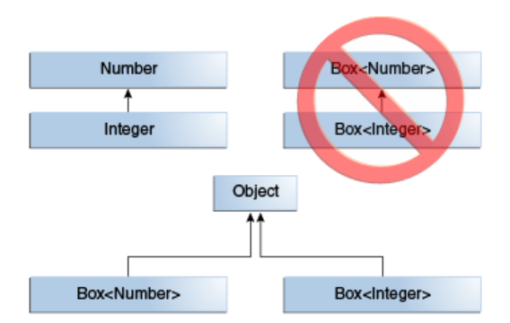
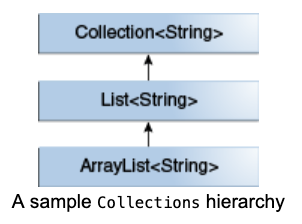
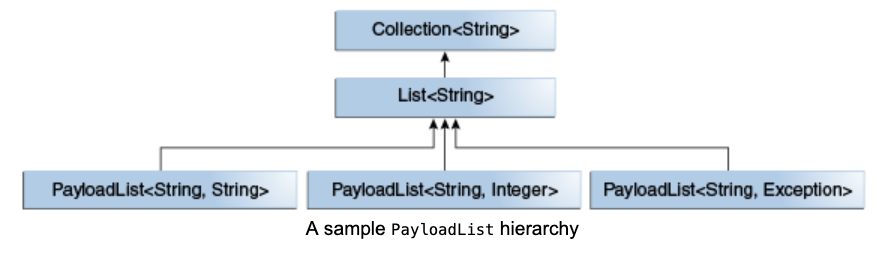

# Generics, Inheritance, and Subtypes

Zaten bildiğiniz gibi, type'lar uyumlu olduğu sürece bir type'da ki object'i başka bir type'da ki object'e atamak
mümkündür. Örneğin, Object Integer'ın supertype'larından biri olduğundan, bir Integer'ı Object'e assign edebilirsiniz:

```
Object someObject = new Object();
Integer someInteger = 10;
someObject = someInteger;   // OK
```

Object-oriented terminolojide, buna `is a` ilişkisi denir. Integer bir tür Object olduğu için, assignment izinlidir.
Ancak Integer aynı zamanda bir `Number` türüdür, bu yüzden aşağıdaki kod da geçerlidir:

```
public void someMethod(Number n) { /* ... */ }

someMethod(10);     // OK
someMethod(10.1);   // OK
```

Aynı durum generics için de geçerlidir. Bir generic type invocation gerçekleştirebilir, type argümanı olarak Number
geçirebilir ve eğer argüman `Number` ile uyumluysa, `add`’in sonraki herhangi bir invocation’ı izinli olacaktır:

```
Box<Number> box = new Box<Number>();
box.add(new Integer(10));   // OK
box.add(new Double(10.1));  // OK
```

Şimdi aşağıdaki method’u düşünün:

```
public void boxTest(Box<Number> n) { /* ... */ }
```

Hangi türde argüman kabul eder? İmzasına bakarak, türü `Box<Number>` olan tek bir argüman kabul ettiğini görebilirsiniz.
Ama bu ne anlama geliyor? Beklediğiniz gibi `Box<Integer>` veya `Box<Double>` geçirme izniniz var mı? Cevap "hayır"dır,
çünkü `Box<Integer>` ve `Box<Double>`, `Box<Number>`’ın subtype’ları değildir. Bu, generics ile programlama söz konusu
olduğunda yaygın bir yanlış anlamadır, ancak öğrenilmesi önemli bir kavramdır.



`Box<Integer>`, Integer Number’ın subtype’ı olmasına rağmen `Box<Number>`’ın subtype’ı değildir.

* Note : İki concrete type `A` ve `B` verildiğinde (örneğin Number ve Integer), `MyClass<A>` ile `MyClass<B>` arasında,
  `A` ve `B` ilişkili olsun olmasın, hiçbir ilişki yoktur.

## Generic Classes and Subtyping

Generic bir class veya interface’i extend ederek veya implement ederek subtype yapabilirsiniz. Bir class veya
interface’in type parametreleri ile başka bir class veya interface’in type parametreleri arasındaki ilişki, extends ve
implements ifadeleriyle belirlenir.

Collections class’larını örnek olarak kullanırsak, `ArrayList<E>` `List<E>`’yi implement eder ve `List<E>`
`Collection<E>`'yi extends eder. Yani `ArrayList<String>`, `List<String>`’in subtype’ıdır ve `List<String>` de
`Collection<String>`’ın subtype’ıdır. Type argümanını değiştirmediğiniz sürece, subtype ilişkisi türler arasında
korunur.



Şimdi, her element ile generic türde optional bir `P` değeri ilişkilendiren kendi list interface’imizi, PayloadList’i
tanımlamak istediğimizi hayal edin. Declaration şöyle görünecektir.

```
interface PayloadList<E,P> extends List<E> {
  void setPayload(int index, P val);
  ...
}
```

Aşağıdaki PayloadList parameterization’ları, `List<String>`’in subtype’larıdır:

```
PayloadList<String,String>
PayloadList<String,Integer>
PayloadList<String,Exception>
```

