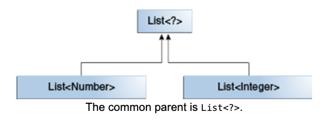
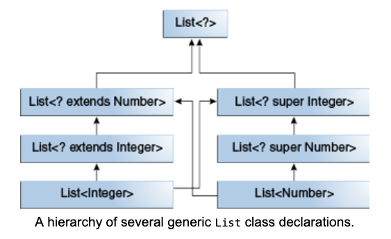

# Wildcards and Subtyping

Generics, Inheritance ve Subtypes bölümlerinde açıklandığı gibi, generic class veya interface'ler, yalnızca type'ları
arasında bir ilişki olması nedeniyle birbirleriyle ilişkili değildir. Ancak, generic class veya interface'ler arasında
bir ilişki oluşturmak için wildcard'lar kullanabilirsiniz.

Aşağıdaki iki normal (non-generic) class verildiğinde:

```
class A { /* ... */ }
class B extends A { /* ... */ }
```

Aşağıdaki kodu yazmak mantıklı olacaktır:

```
B b = new B();
A a = b;
```

Bu örnek, normal class'ların inheritance'ının şu subtyping kuralını izlediğini gösterir: Class `B`, eğer `A`'yı extend
ediyorsa, class `A`'nın bir subtype'ıdır. Bu kural generic type'lar için geçerli `değildir`:

```
List<B> lb = new ArrayList<>();
List<A> la = lb;   // compile-time error
```

Integer bir Number subtype'ı olduğuna göre, `List<Integer>` ile `List<Number>` arasında ne tür bir ilişki vardır?



Integer bir Number subtype'ı olmasına rağmen, `List<Integer>` `List<Number>`'ın subtype'ı değildir ve aslında bu iki tür
arasında herhangi bir ilişki yoktur. `List<Number>` ve `List<Integer>`'ın ortak parent'ı List<`?`>'dir.

Kodun `List<Integer>` elementleri aracılığıyla Number method'larına erişebilmesi için, bu sınıflar arasında bir ilişki
oluşturmak amacıyla upper bounded wildcard kullanın:

```
List<? extends Integer> intList = new ArrayList<>();
List<? extends Number>  numList = intList;  // OK. List<? extends Integer> is a subtype of List<? extends Number>
```

Integer bir Number subtype'ı olduğu için ve `numList` Number object'lerinden oluşan bir liste olduğundan, `intList`
(Integer object'lerinden oluşan bir liste) ile `numList` arasında artık bir ilişki vardır. Aşağıdaki diyagram, hem upper
hem de lower bounded wildcard'larla declare edilmiş çeşitli List class'ları arasındaki ilişkileri gösterir.

